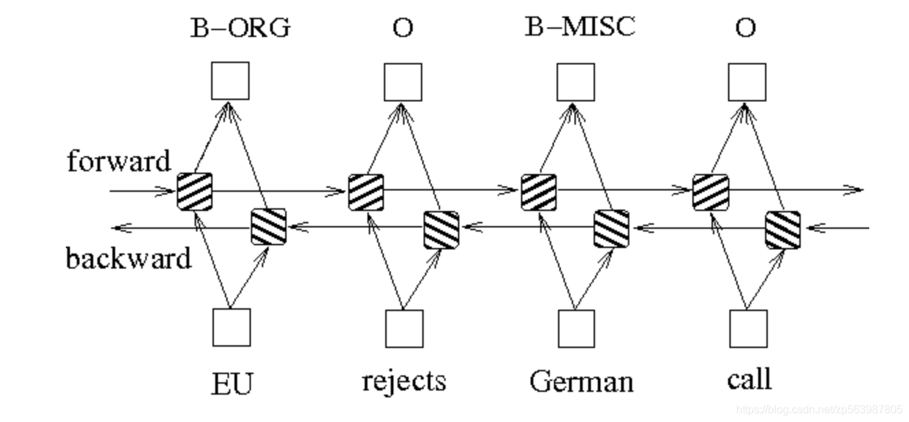

# <center>用于中文命名实体识别的递归神经网络</center>
命名实体识别作为序列标注类的典型任务，其使用场景特别广泛。本项目基于PyTorch搭建BiLSTM+CRF模型，实现中文命名识别任务，代码已提交至Github（ GitHub： https://github.com/CaoYuGang/ChineseNER_BiLSTM ）。
## 模型
该模型是具有CRF层的双区域LSTM神经网络。汉字序列被投影到密集的向量序列中，并带有多余的特征作为循环层的输入，这里我们使用一个代表词边界特征的热向量进行说明。循环层是双向LSTM层，前向和后向向量的输出被汇总并投影为每个标签的得分。CRF层用于克服标签偏斜问题。

我们的模型类似于基于字符的Bi-LSTM-CRF中提出的具有基本水平功能的中文命名实体识别中最先进的中文命名实体识别模型。其中Bi-LSTM是循环神经网络RNN的改进型LSTM，特别适用于时序文本数据的处理。LSTM依靠神经网络超强的非线性拟合能力以及隐状态对信息的传递，在训练时将样本通过高维空间中的复杂非线性变换，学习到从样本到标注的函数。


## 学习资料
1.制定动态决策和BI-LSTM CRF（ https://pytorch.org/tutorials/beginner/nlp/advanced_tutorial.html ）<br/>
2.BiLSTM模型解析（ https://createmomo.github.io/2017/11/11/CRF-Layer-on-the-Top-of-BiLSTM-5/ ）

## 文件解析
```
CHINESENER_BILSTM
│  config.py
│  README.md
│  test.py
│  train.py
|
├─model
│      bi-lstm-crf-61-15000.pkl
│      word_to_ix.json

ps:
config.py: 训练和运行测试时的相关配置，训练时根据自己的数据集的情况对配置文件进行修改，修改部分包括模型保存训练次数间隔、训练循环次数等
test.py: 测试模型的相关文件
train.py：训练模型的相关配置
model：
    bi-lstm-crf-1-5000.pkl： 训练完成的案例模型(测试模型，非最终模型)
    word_to_ix.json： 训练时生成的文字集
```

## 数据集说明
```
依法公开审理$许道军$诉$李术源$民间借贷纠纷一案
```
其中使用$之间的名称代表实体，生成数据集进行训练。本项目可以通过新增打标符号以及修改config.py中的TAG_IO_IX，TAG_IO_CN参数实现多类型实体提取。

## 项目声明
如有任何问题欢迎加群讨论（QQ群：584859737）。
本项目提供一种实体提取的技术实战。项目仅供与个人研究，请勿进行商业操作。